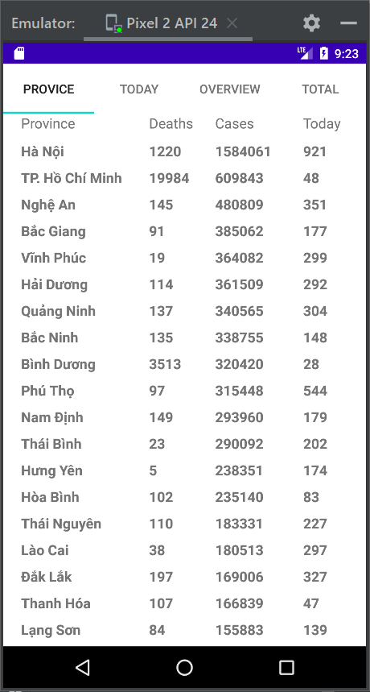
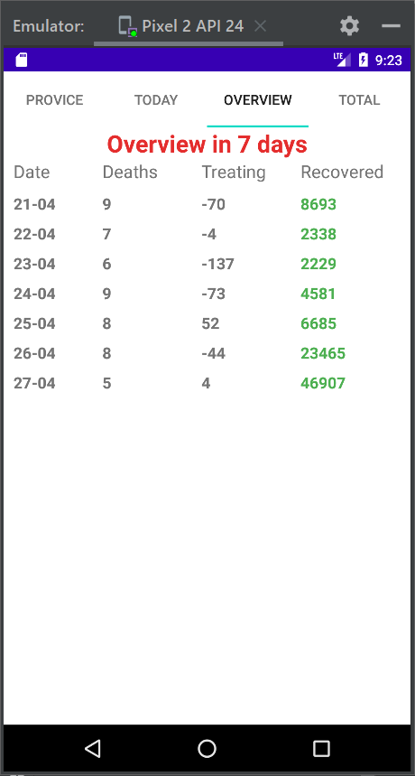
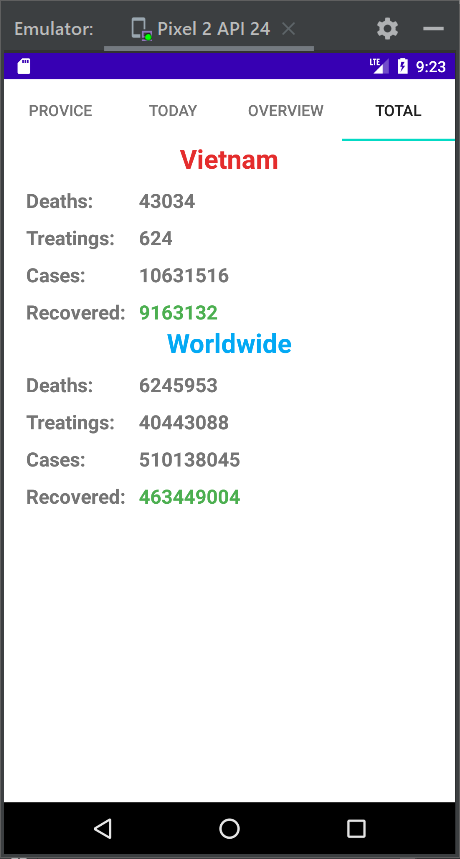

<h1 align="center">Vietnam COVID-19 Tracker 

A lightweight Android application helps us following the process of Coronavirus COVID-19

</h1>

    

# [**Table Of Content**](#table-of-content)
- [**Table Of Content**](#table-of-content)
- [**What is COVID-19 ?**](#what-is-covid-19-)
- [**How it spreads**](#how-it-spreads)
- [**Architecture**](#architecture)
- [**Download**](#download)
- [**Data Source**](#data-source)
- [**Video**](#video)
- [**Features**](#features)
- [**Made with 💘 and JAVA **](#made-with--and-java-)

# [**What is COVID-19 ?**](#what-is-covid-19)
Coronavirus disease (COVID-19) is an infectious disease caused by the SARS-CoV-2 virus.
Most people who fall sick with COVID-19 will experience mild to moderate symptoms and recover without special treatment. However, some will become seriously ill and require medical attention. Older people and those with underlying medical conditions like cardiovascular disease, diabetes, chronic respiratory disease, or cancer are more likely to develop serious illness. Anyone can get sick with COVID-19 and become seriously ill or die at any age. 

The best way to prevent and slow down transmission is to be well informed about the disease and how the virus spreads. Protect yourself and others from infection by staying at least 1 metre apart from others, wearing a properly fitted mask, and washing your hands or using an alcohol-based rub frequently. Get vaccinated when it’s your turn and follow local guidance.

The virus can spread from an infected person’s mouth or nose in small liquid particles when they cough, sneeze, speak, sing or breathe. These particles range from larger respiratory droplets to smaller aerosols. It is important to practice respiratory etiquette, for example by coughing into a flexed elbow, and to stay home and self-isolate until you recover if you feel unwell.

# [**How it spreads**](#how-it-spreads)

The virus can spread from an infected person’s mouth or nose in small liquid particles when they cough, sneeze, speak, sing or breathe. These particles range from larger respiratory droplets to smaller aerosols.
You can be infected by breathing in the virus if you are near someone who has COVID-19, or by touching a contaminated surface and then your eyes, nose or mouth. The virus spreads more easily indoors and in crowded settings.

# [**Architecture**](#architecture)

I am a newbie to Android programming. I tried to build the application following a renowned design-pattern, **Model-View-ViewModel** or **MVVM**, however. So I would happy if some one can explore my source code🤗🤗🤗

    

<h3 align="center">

***My directory structure***
</h3>

# [**Download**](#download)

You can easily download my COVID-19 application right [**here**](https://github.com/Phong-Kaster/Vietnam-COVID-19-Tracker/raw/main/app-debug.apk)

# [**Data Source**](#data-source)

This application uses [**Retrofit2**](#) library which is used to communicate with the API in the link below:

http://static.pipezero.com/covid/data.json

If you have trouble with read the JSON-formatted data. You can try [**Code Beautify**](https://codebeautify.org/jsonviewer) to rearrange data's structure. And the JSON-formatted data would like below here:

    {
    "total": {
        "internal": {
        "death": 43004,
        "treating": 685,
        "cases": 10554689,
        "recovered": 9081494
        },
        "world": {
        "death": 6236930,
        "treating": 41363987,
        "cases": 507934419,
        "recovered": 460333502
        }
    },
    "today": {
        "internal": {
        "death": 6,
        "treating": -137,
        "cases": 10365,
        "recovered": 2229
        },
        "world": {
        "death": 0,
        "treating": 0,
        "cases": 0,
        "recovered": 0
        }
    },
    "overview": [
        {
        "date": "17-04",
        "death": 10,
        "treating": -121,
        "cases": 14660,
        "recovered": 5472,
        "avgCases7day": 19543,
        "avgRecovered7day": 21446,
        "avgDeath7day": 10
        },
        {
        "date": "18-04",
        "death": 13,
        "treating": -62,
        "cases": 43272,
        "recovered": 4218,
        "avgCases7day": 19543,
        "avgRecovered7day": 21446,
        "avgDeath7day": 10
        },
        {
        "date": "19-04",
        "death": 18,
        "treating": 2,
        "cases": 13500,
        "recovered": 124630,
        "avgCases7day": 19543,
        "avgRecovered7day": 21446,
        "avgDeath7day": 10
        },
        {
        "date": "20-04",
        "death": 7,
        "treating": -114,
        "cases": 13271,
        "recovered": 2540,
        "avgCases7day": 19543,
        "avgRecovered7day": 21446,
        "avgDeath7day": 10
        },
        {
        "date": "21-04",
        "death": 9,
        "treating": -70,
        "cases": 30574,
        "recovered": 8693,
        "avgCases7day": 19543,
        "avgRecovered7day": 21446,
        "avgDeath7day": 10
        },
        {
        "date": "22-04",
        "death": 7,
        "treating": -4,
        "cases": 11160,
        "recovered": 2338,
        "avgCases7day": 19543,
        "avgRecovered7day": 21446,
        "avgDeath7day": 10
        },
        {
        "date": "23-04",
        "death": 6,
        "treating": -137,
        "cases": 10365,
        "recovered": 2229,
        "avgCases7day": 19543,
        "avgRecovered7day": 21446,
        "avgDeath7day": 10
        }
    ],
    "locations": [
        {
        "name": "Hà Nội",
        "death": 1220,
        "treating": 0,
        "cases": 1540292,
        "recovered": 0,
        "casesToday": 978
        },
        {
        "name": "TP. Hồ Chí Minh",
        "death": 19984,
        "treating": 0,
        "cases": 609645,
        "recovered": 0,
        "casesToday": 76
        }

    }

# [**Video**](#video)

    

<h3 align="center">

***Video***

# [**Features**](#features)

As I said before, with respect to Android programming, I am a limited-experienced one so that features in this application is so easy as ABC. There are 4 tabs that shows each important information respectively:

**PROVINCE** - presents deaths, cases and new cases from 63 provinces in Vietnam

**TODAY** - describes number of people died by COVID-19, number of treating patients, total cases and new cases in the current day.

**OVERVIEW** - demonstrates number of deaths / cases / treating / recovered people in the last 7 days 

**TOTAL** - as the name of this tab, total statistics from all people who have been effected by Coronavirus COVID-19.

 You can see layout and tabs I have built up with there referenced photos right here: 

    
    
    
    

<h3 align="center">

***There are 4 tabs. Each tab performs one important information differently***
</h3>

 
# [**Made with 💘 and JAVA **](#made-with-love-and-php)